# DIAGRAMS.md

**Design Baseline v1.1 — PROPOSED FREEZE, AWAITING OWNER APPROVAL.** Final approved Mermaid diagrams (Step 15 plus the freeze-review corrections listed at the end of this file).
Each diagram is separate. OPEN items are labelled **OPEN** or **pending** and are never resolved here.
There is **no Inventory diagram and no X-ray diagram** by design.

---

## Diagram 1: System Context

The clinic system serves three internal roles. The patient is a business entity only: treated and billed, never signing in. Patients submit feedback on the clinic's own website.

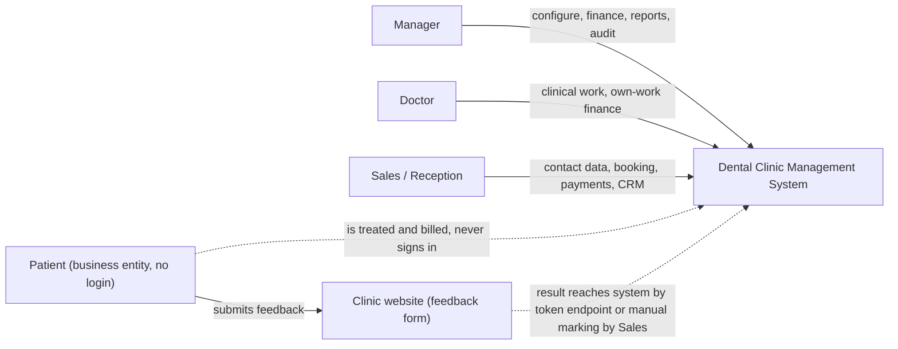
```mermaid
flowchart LR
    M["Manager"]
    D["Doctor"]
    S["Sales / Reception"]
    P["Patient (business entity, no login)"]
    SYS["Dental Clinic Management System"]
    WEB["Clinic website (feedback form)"]

    M -->|"configure, finance, reports, audit"| SYS
    D -->|"clinical work, own-work finance"| SYS
    S -->|"contact data, booking, payments, CRM"| SYS
    P -.->|"is treated and billed, never signs in"| SYS
    P -->|"submits feedback"| WEB
    WEB -.->|"result reaches system by token endpoint or manual marking by Sales"| SYS
```

**OPEN note:** which of the two feedback-result paths is used is **Q-FDB-2**.

**v1.1 note:** the clinic also employs Assistants. They are staff records with payroll only, have no login and are therefore **not** a system actor in this diagram.

---

## Diagram 2: High-Level Application Architecture

One modular-monolith API process, one Worker process (same codebase), one managed PostgreSQL database with one schema per module.

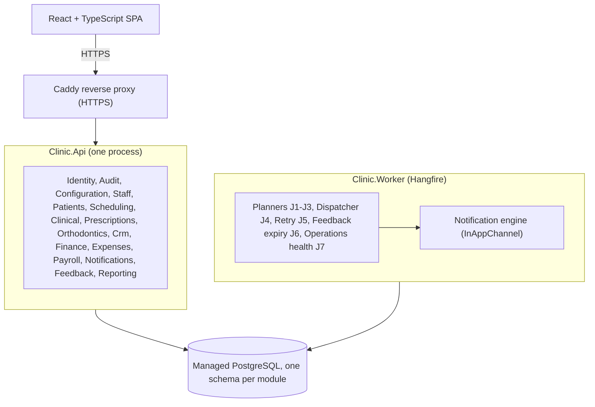
```mermaid
flowchart TB
    SPA["React + TypeScript SPA"]
    PROXY["Caddy reverse proxy (HTTPS)"]
    subgraph API["Clinic.Api (one process)"]
        direction TB
        MODS["Identity, Audit, Configuration, Staff, Patients, Scheduling, Clinical, Prescriptions, Orthodontics, Crm, Finance, Expenses, Payroll, Notifications, Feedback, Reporting"]
    end
    subgraph WRK["Clinic.Worker (Hangfire)"]
        JOBS["Planners J1-J3, Dispatcher J4, Retry J5, Feedback expiry J6, Operations health J7"]
        NE["Notification engine (InAppChannel)"]
    end
    DB[("Managed PostgreSQL, one schema per module")]

    SPA -->|"HTTPS"| PROXY --> API
    API --> DB
    WRK --> DB
    JOBS --> NE
```

---

## Diagram 3: Module Dependency

Arrows point to the module depended on, and always to a lower level (compile-time architecture tests enforce this). Events flow from a lower publisher to a higher subscriber. Reporting reads other modules read-only and nothing depends on it.

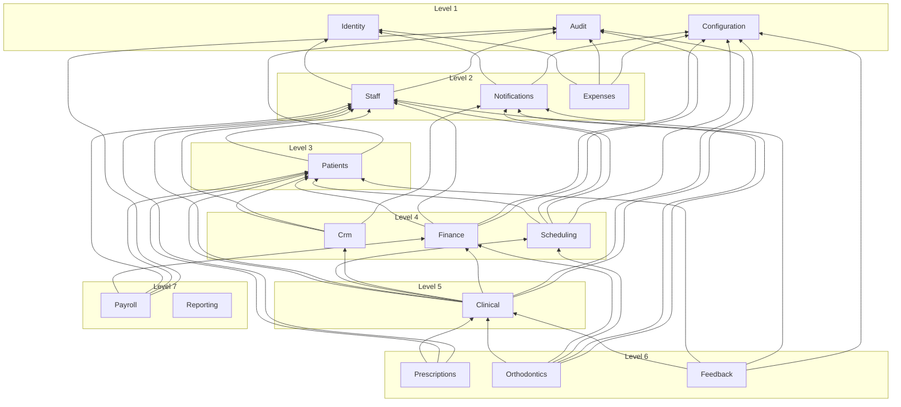
```mermaid
flowchart BT
    subgraph L1["Level 1"]
        Audit
        Configuration
        Identity
    end
    subgraph L2["Level 2"]
        Staff
        Notifications
        Expenses
    end
    subgraph L3["Level 3"]
        Patients
    end
    subgraph L4["Level 4"]
        Scheduling
        Crm
        Finance
    end
    subgraph L5["Level 5"]
        Clinical
    end
    subgraph L6["Level 6"]
        Prescriptions
        Orthodontics
        Feedback
    end
    subgraph L7["Level 7"]
        Payroll
        Reporting
    end

    Staff --> Identity
    Staff --> Audit
    Notifications --> Identity
    Notifications --> Configuration
    Expenses --> Identity
    Expenses --> Audit
    Expenses --> Configuration
    Patients --> Staff
    Patients --> Audit
    Scheduling --> Patients
    Scheduling --> Staff
    Scheduling --> Notifications
    Scheduling --> Configuration
    Crm --> Patients
    Crm --> Staff
    Crm --> Notifications
    Finance --> Patients
    Finance --> Staff
    Finance --> Configuration
    Finance --> Audit
    Clinical --> Patients
    Clinical --> Staff
    Clinical --> Scheduling
    Clinical --> Crm
    Clinical --> Finance
    Clinical --> Audit
    Clinical --> Configuration
    Prescriptions --> Clinical
    Prescriptions --> Patients
    Prescriptions --> Staff
    Orthodontics --> Clinical
    Orthodontics --> Finance
    Orthodontics --> Scheduling
    Orthodontics --> Notifications
    Orthodontics --> Staff
    Feedback --> Clinical
    Feedback --> Patients
    Feedback --> Notifications
    Feedback --> Configuration
    Payroll --> Finance
    Payroll --> Staff
    Payroll --> Patients
    Payroll --> Audit
```

Finance never calls Clinical: Clinical passes the Doctor, percentage snapshot and lab model to Finance as data. Cross-module database foreign keys may point in any direction; only code dependencies follow the levels.

---

## Diagram 4: Role / Permission

One operational role per account (database-enforced). Contact-bearing permission keys are never mapped to Doctor. Doctors have no notification inbox in V1.

**v1.1 note:** *Assistant* is a staff type, **not** an application role, and therefore does not appear in this diagram. Assistant records and payroll are reached only through Manager-only keys (`Staff.Manage`, `Staff.AssistantSalary.Configure`, `Payroll.Assistant.ManageAll`) held by the MANAGER role.

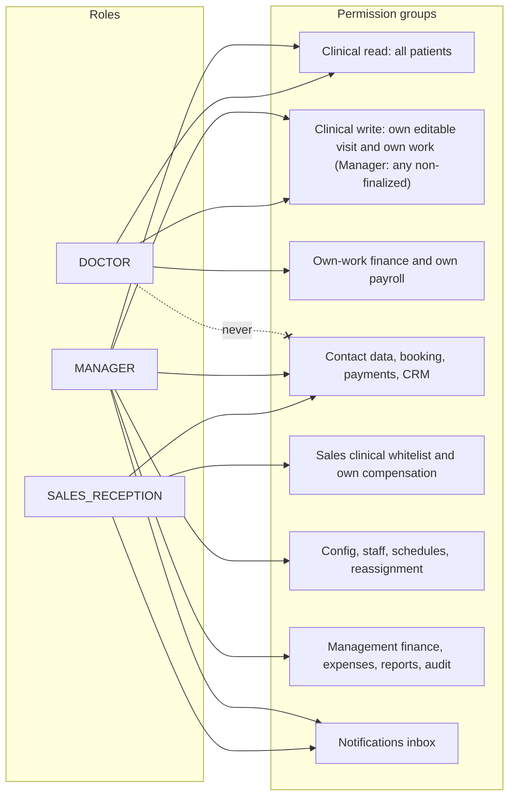
```mermaid
flowchart LR
    subgraph Roles
        DOC["DOCTOR"]
        SAL["SALES_RECEPTION"]
        MAN["MANAGER"]
    end
    subgraph Keys["Permission groups"]
        K1["Clinical read: all patients"]
        K2["Clinical write: own editable visit and own work (Manager: any non-finalized)"]
        K3["Own-work finance and own payroll"]
        K4["Contact data, booking, payments, CRM"]
        K5["Sales clinical whitelist and own compensation"]
        K6["Config, staff, schedules, reassignment"]
        K7["Management finance, expenses, reports, audit"]
        K8["Notifications inbox"]
    end
    DOC --> K1
    DOC --> K2
    DOC --> K3
    SAL --> K4
    SAL --> K5
    SAL --> K8
    MAN --> K1
    MAN --> K2
    MAN --> K4
    MAN --> K6
    MAN --> K7
    MAN --> K8
    DOC -.-x|"never"| K4
```

**OPEN note:** `Finance.Discount.Set` and `Orthodontics.Terms.Set` exist as keys but are assigned to **no role**. Whether Sales may Cancel / Confirm / mark No Show is unresolved (Manager holds `Scheduling.Appointments.UpdateStatus` today).

---

## Diagram 5: Patient Lifecycle

Lead to feedback. A lead's Original Sales Employee is preserved at conversion. A direct walk-in registration does not assign one. There is no arrival or check-in step between Appointment and Visit (Q-APP-4 OPEN).

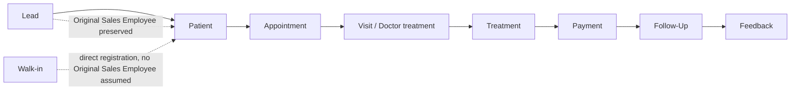
```mermaid
flowchart LR
    L["Lead"] --> P["Patient"]
    P --> A["Appointment"]
    A --> D["Visit / Doctor treatment"]
    D --> T["Treatment"]
    T --> PAY["Payment"]
    PAY --> F["Follow-Up"]
    F --> FB["Feedback"]
    W["Walk-in"] -.->|"direct registration, no Original Sales Employee assumed"| P
    L -.->|"Original Sales Employee preserved"| P
```

---

## Diagram 6: Doctor Treatment Workflow

The Doctor's visit flow with all procedure branches. The Doctor enters a price and never a discount. Fixed lab is entered once per case. Continuing an existing case adds a treatment record and does not create a new billable work item.

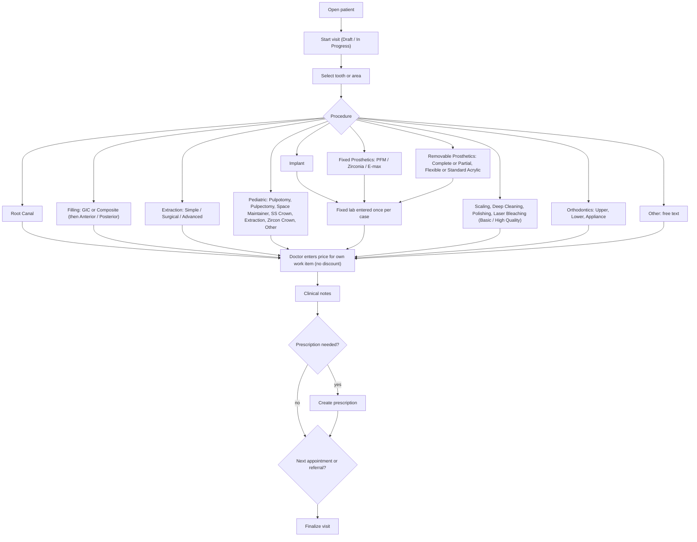
```mermaid
flowchart TD
    S["Open patient"] --> V["Start visit (Draft / In Progress)"]
    V --> TA["Select tooth or area"]
    TA --> PR{"Procedure"}
    PR --> RC["Root Canal"]
    PR --> FI["Filling: GIC or Composite (then Anterior / Posterior)"]
    PR --> EX["Extraction: Simple / Surgical / Advanced"]
    PR --> PE["Pediatric: Pulpotomy, Pulpectomy, Space Maintainer, SS Crown, Extraction, Zircon Crown, Other"]
    PR --> IM["Implant"]
    PR --> FP["Fixed Prosthetics: PFM / Zirconia / E-max"]
    PR --> RP["Removable Prosthetics: Complete or Partial, Flexible or Standard Acrylic"]
    PR --> SC["Scaling, Deep Cleaning, Polishing, Laser Bleaching (Basic / High Quality)"]
    PR --> OR["Orthodontics: Upper, Lower, Appliance"]
    PR --> OT["Other: free text"]
    RC --> PRICE
    FI --> PRICE
    EX --> PRICE
    PE --> PRICE
    IM --> LAB["Fixed lab entered once per case"]
    FP --> LAB
    RP --> LAB
    LAB --> PRICE
    SC --> PRICE
    OR --> PRICE
    OT --> PRICE
    PRICE["Doctor enters price for own work item (no discount)"] --> N["Clinical notes"]
    N --> RX{"Prescription needed?"}
    RX -->|"yes"| RXC["Create prescription"]
    RX -->|"no"| NA
    RXC --> NA{"Next appointment or referral?"}
    NA --> FIN["Finalize visit"]
```

---

## Diagram 7: Root Canal Workflow

A root canal is one treatment case that may span several visits. Completed steps persist and are visible to other Doctors, who can read but not modify them.

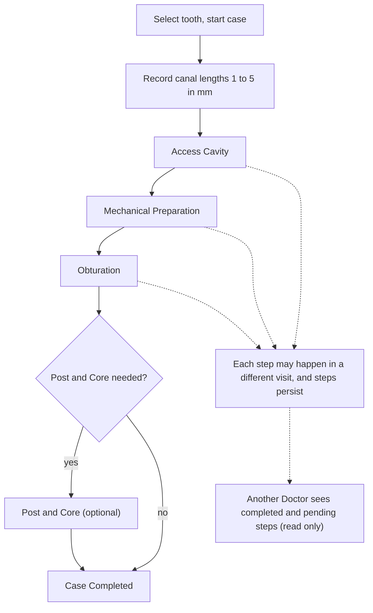
```mermaid
flowchart TD
    A["Select tooth, start case"] --> B["Record canal lengths 1 to 5 in mm"]
    B --> S1["Access Cavity"]
    S1 --> S2["Mechanical Preparation"]
    S2 --> S3["Obturation"]
    S3 --> Q{"Post and Core needed?"}
    Q -->|"yes"| S4["Post and Core (optional)"]
    Q -->|"no"| E["Case Completed"]
    S4 --> E
    S1 -.-> VN["Each step may happen in a different visit, and steps persist"]
    S2 -.-> VN
    S3 -.-> VN
    VN -.-> OD["Another Doctor sees completed and pending steps (read only)"]
```

---

## Diagram 8: Appointment Workflow

Seven confirmed statuses (Scheduled, Confirmed, In Treatment, Completed, Cancelled, No Show, Rescheduled). Arrived and Waiting were removed in v1.1 and are not replaced. A change to date, time or Doctor never overwrites: the old appointment becomes Rescheduled and a new one points back to it.

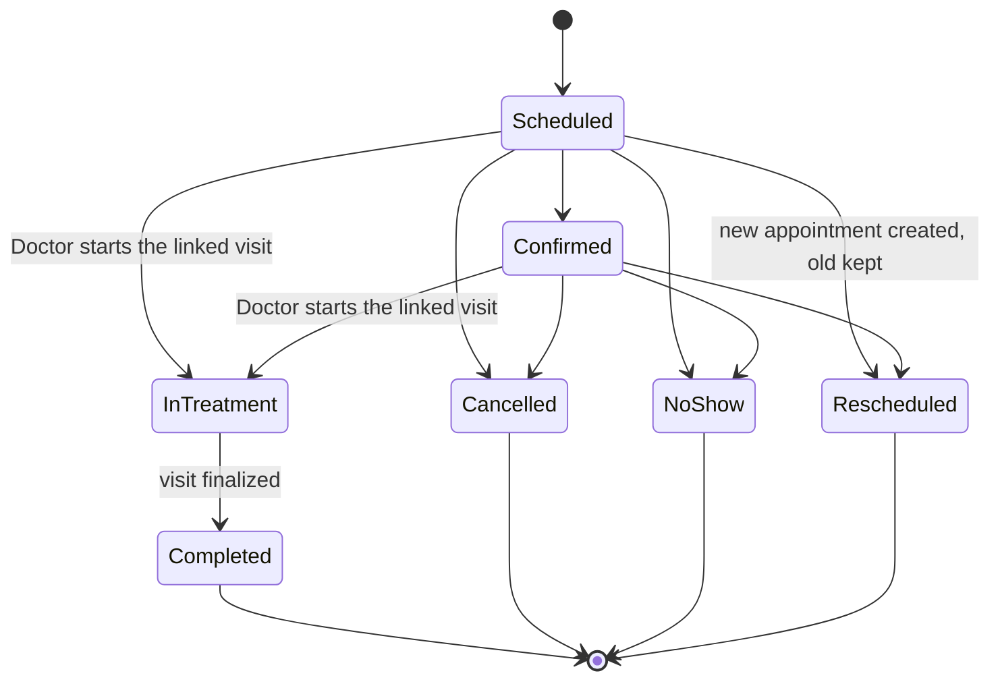
```mermaid
stateDiagram-v2
    [*] --> Scheduled
    Scheduled --> Confirmed
    Scheduled --> InTreatment: Doctor starts the linked visit
    Confirmed --> InTreatment: Doctor starts the linked visit
    InTreatment --> Completed: visit finalized
    Scheduled --> Cancelled
    Confirmed --> Cancelled
    Scheduled --> NoShow
    Confirmed --> NoShow
    Scheduled --> Rescheduled: new appointment created, old kept
    Confirmed --> Rescheduled
    Completed --> [*]
    Cancelled --> [*]
    NoShow --> [*]
    Rescheduled --> [*]
```

**OPEN note:** who may perform Cancel, Confirm and No Show for Sales is unresolved (Q-APP-3). The Manager holds it today. Whether and how patient arrival is tracked is unresolved (Q-APP-4); no arrival state, check-in action or waiting queue exists.

---

## Diagram 9: Doctor Weekly Availability

The Manager publishes each Doctor's weekly availability. Sales books only inside published ranges, and the database prevents double-booking of one slot.

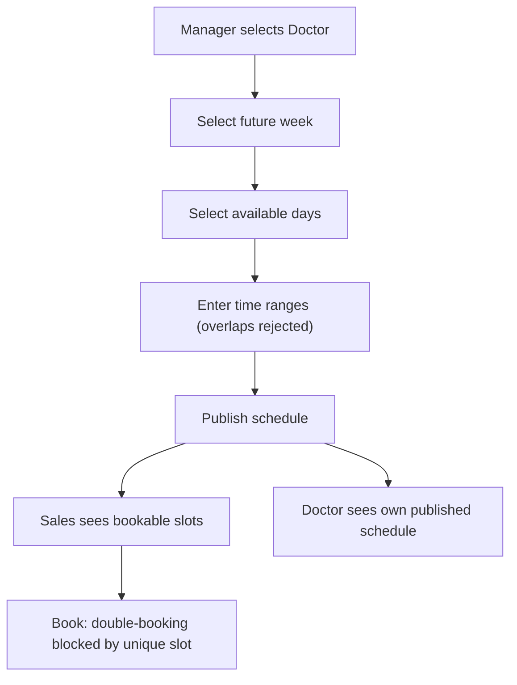
```mermaid
flowchart TD
    M["Manager selects Doctor"] --> W["Select future week"]
    W --> D["Select available days"]
    D --> R["Enter time ranges (overlaps rejected)"]
    R --> PUB["Publish schedule"]
    PUB --> SV["Sales sees bookable slots"]
    PUB --> DV["Doctor sees own published schedule"]
    SV --> BK["Book: double-booking blocked by unique slot"]
```

**OPEN note:** appointment duration, overlap and Manager override of a full schedule are unresolved (Q-APP-1, Q-APP-2).

---

## Diagram 10: Implant Workflow

The Doctor chooses exactly one healing period (1 to 6 months), enters the single fixed lab for the case, and picks the next appointment, which appears for the Doctor, the Sales team and the calendar and triggers a Sales reminder the day before.

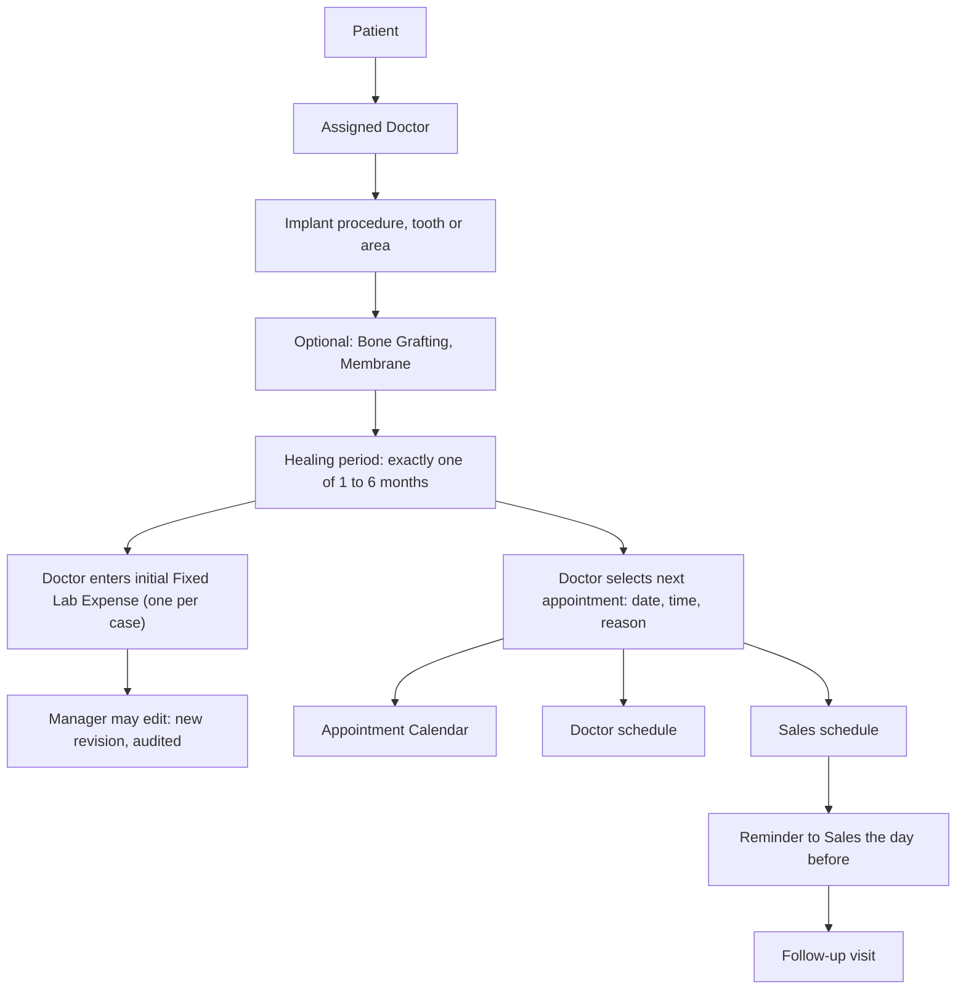
```mermaid
flowchart TD
    P["Patient"] --> AD["Assigned Doctor"]
    AD --> IP["Implant procedure, tooth or area"]
    IP --> OPT["Optional: Bone Grafting, Membrane"]
    OPT --> H["Healing period: exactly one of 1 to 6 months"]
    H --> FL["Doctor enters initial Fixed Lab Expense (one per case)"]
    FL --> ME["Manager may edit: new revision, audited"]
    H --> NA["Doctor selects next appointment: date, time, reason"]
    NA --> CAL["Appointment Calendar"]
    NA --> DS["Doctor schedule"]
    NA --> SS["Sales schedule"]
    SS --> RM["Reminder to Sales the day before"]
    RM --> FU["Follow-up visit"]
```

---

## Diagram 11: Orthodontic Workflow

Payments are allocated to the orthodontic charge. Installment application is **pending** and no installment-to-payment mapping is created in V1.

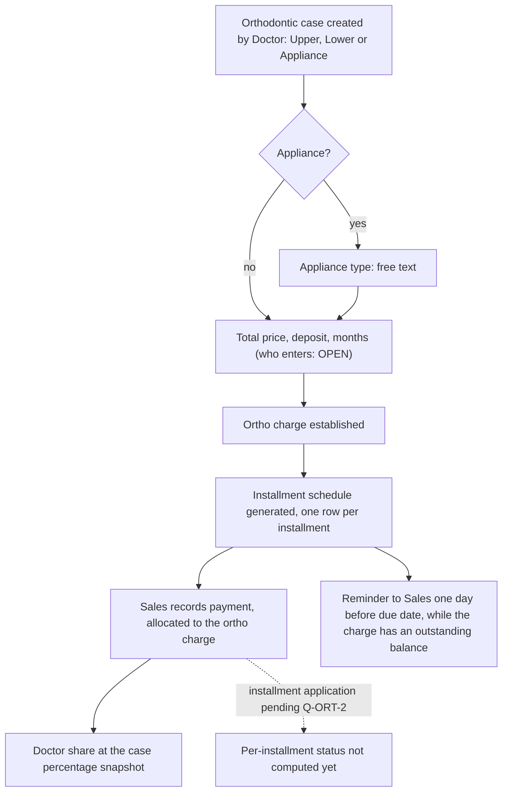
```mermaid
flowchart TD
    A["Orthodontic case created by Doctor: Upper, Lower or Appliance"] --> AP{"Appliance?"}
    AP -->|"yes"| FT["Appliance type: free text"]
    AP -->|"no"| TERMS
    FT --> TERMS["Total price, deposit, months (who enters: OPEN)"]
    TERMS --> CHG["Ortho charge established"]
    CHG --> SCH["Installment schedule generated, one row per installment"]
    SCH --> PAYM["Sales records payment, allocated to the ortho charge"]
    PAYM --> SPLIT["Doctor share at the case percentage snapshot"]
    PAYM -.->|"installment application pending Q-ORT-2"| APPL["Per-installment status not computed yet"]
    SCH --> REM["Reminder to Sales one day before due date, while the charge has an outstanding balance"]
```

**OPEN note:** the case record exists before terms; the charge, deposit, months and schedule exist only once the actor for the terms is decided (Q-ORT-4).

---

## Diagram 12: Referral Workflow

A Doctor referral appears to Sales automatically and notifies Sales. Sales works it through the confirmed statuses.

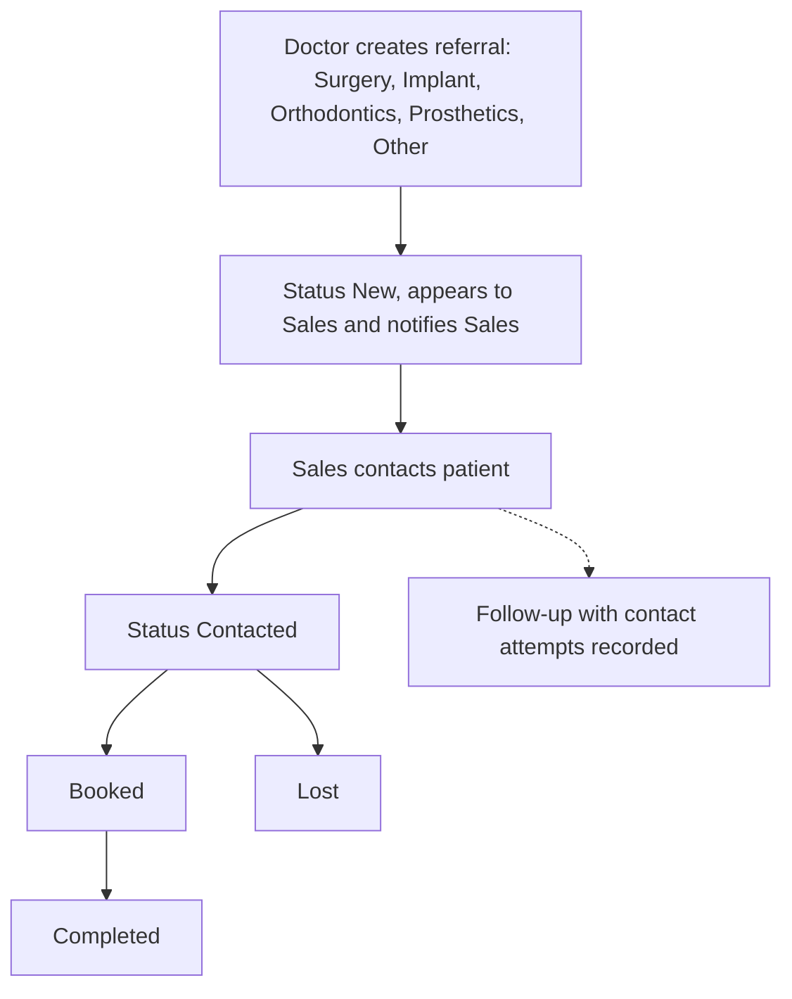
```mermaid
flowchart TD
    D["Doctor creates referral: Surgery, Implant, Orthodontics, Prosthetics, Other"] --> N["Status New, appears to Sales and notifies Sales"]
    N --> C["Sales contacts patient"]
    C --> CT["Status Contacted"]
    CT --> B["Booked"]
    CT --> LOST["Lost"]
    B --> CO["Completed"]
    C -.-> FU["Follow-up with contact attempts recorded"]
```

**OPEN note:** whether Sales sees the Doctor's referral reason is a configuration setting, unset (hidden) today (Q-PRV-1).

---

## Diagram 13: Prescription Workflow

Editable while the visit is not finalized. After finalization the record is protected, and any permitted correction must be audited. The printable model contains no patient contact data.

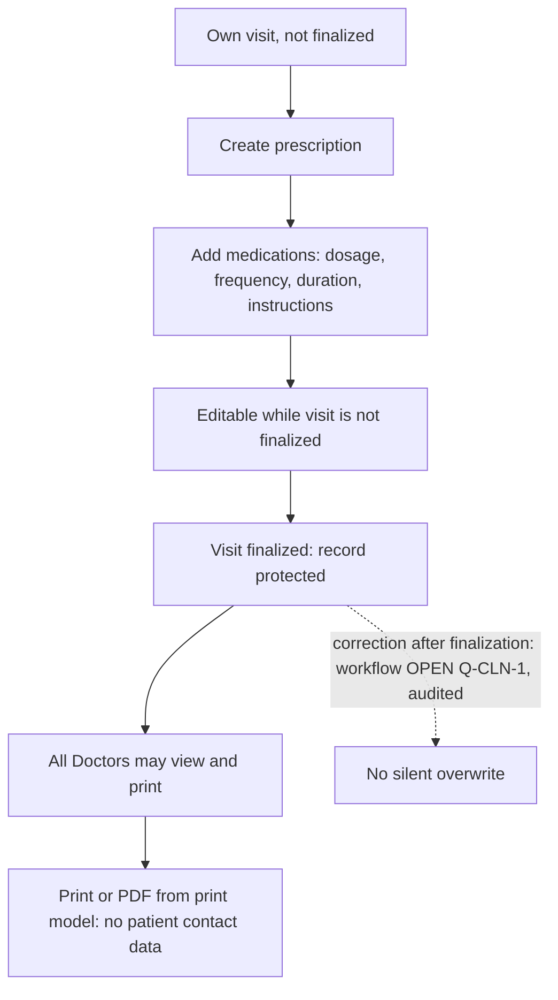
```mermaid
flowchart TD
    V["Own visit, not finalized"] --> RX["Create prescription"]
    RX --> IT["Add medications: dosage, frequency, duration, instructions"]
    IT --> ED["Editable while visit is not finalized"]
    ED --> FIN["Visit finalized: record protected"]
    FIN --> VW["All Doctors may view and print"]
    FIN -.->|"correction after finalization: workflow OPEN Q-CLN-1, audited"| COR["No silent overwrite"]
    VW --> PDF["Print or PDF from print model: no patient contact data"]
```

---

## Diagram 14: Finance Workflow

Payment to allocation to Doctor Earning to Lab/Clinic completion. Held allocations (Q-FIN-9) and pending completions (Q-FIN-1, W2) are explicit states, and neither blocks the payment, the allocation or Outstanding.

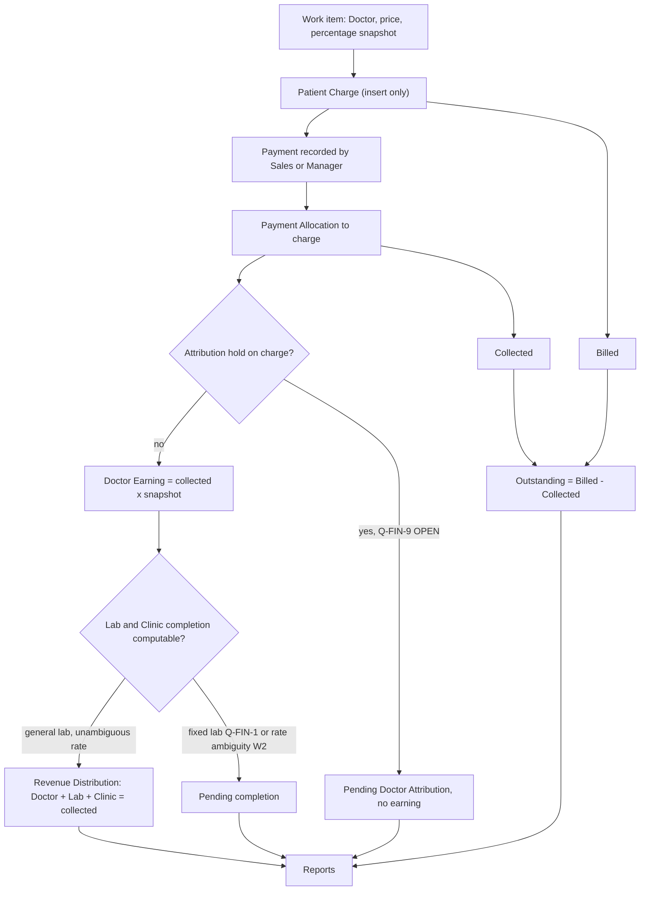
```mermaid
flowchart TD
    WI["Work item: Doctor, price, percentage snapshot"] --> CH["Patient Charge (insert only)"]
    CH --> PM["Payment recorded by Sales or Manager"]
    PM --> AL["Payment Allocation to charge"]
    AL --> HOLD{"Attribution hold on charge?"}
    HOLD -->|"no"| DE["Doctor Earning = collected x snapshot"]
    HOLD -->|"yes, Q-FIN-9 OPEN"| PEND["Pending Doctor Attribution, no earning"]
    DE --> CMP{"Lab and Clinic completion computable?"}
    CMP -->|"general lab, unambiguous rate"| RD["Revenue Distribution: Doctor + Lab + Clinic = collected"]
    CMP -->|"fixed lab Q-FIN-1 or rate ambiguity W2"| PC["Pending completion"]
    AL --> COL["Collected"]
    CH --> BILL["Billed"]
    BILL --> OUT["Outstanding = Billed - Collected"]
    COL --> OUT
    RD --> REP["Reports"]
    PC --> REP
    PEND --> REP
    OUT --> REP
```

**OPEN note:** when a charge is established (W1) and who sets a discount (Q-FIN-3) are unresolved. Consultation charges produce no earning or distribution and are Clinic-side revenue.

---

## Diagram 15: Lab Expense Workflow

Two lab models. Neither ever reduces the Doctor Share.

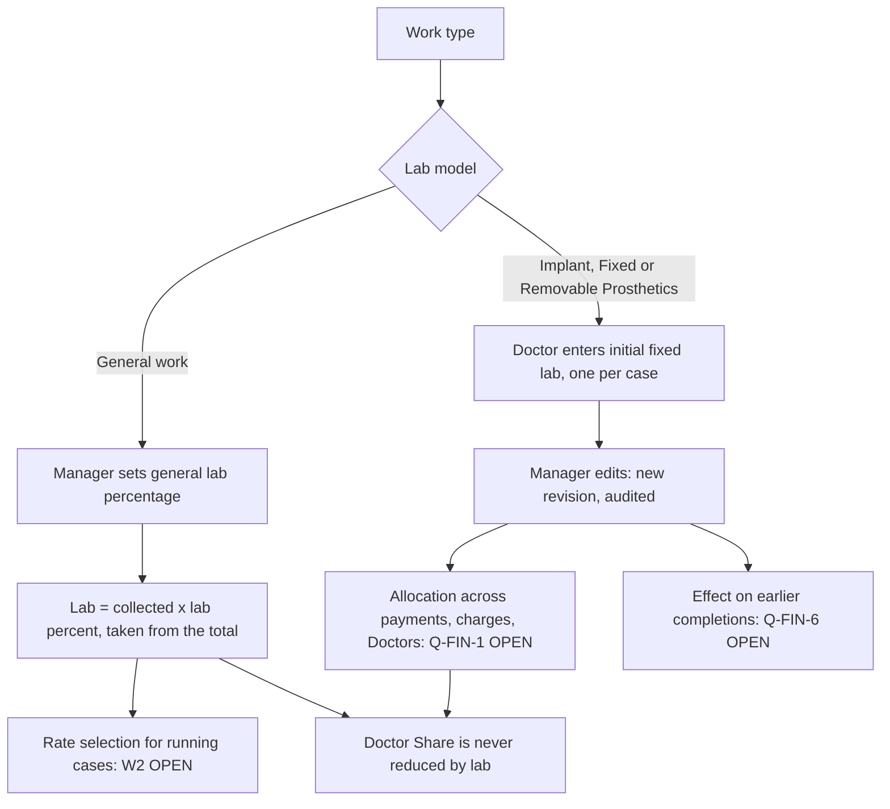
```mermaid
flowchart TD
    W["Work type"] --> T{"Lab model"}
    T -->|"General work"| G["Manager sets general lab percentage"]
    G --> G2["Lab = collected x lab percent, taken from the total"]
    G2 --> G3["Rate selection for running cases: W2 OPEN"]
    T -->|"Implant, Fixed or Removable Prosthetics"| F["Doctor enters initial fixed lab, one per case"]
    F --> F2["Manager edits: new revision, audited"]
    F2 --> F3["Allocation across payments, charges, Doctors: Q-FIN-1 OPEN"]
    F2 --> F4["Effect on earlier completions: Q-FIN-6 OPEN"]
    G2 --> DS["Doctor Share is never reduced by lab"]
    F3 --> DS
```

---

## Diagram 16: Doctor Payroll Workflow

Payroll aggregates recognized Doctor Earnings. A later rate change never recalculates a payroll.

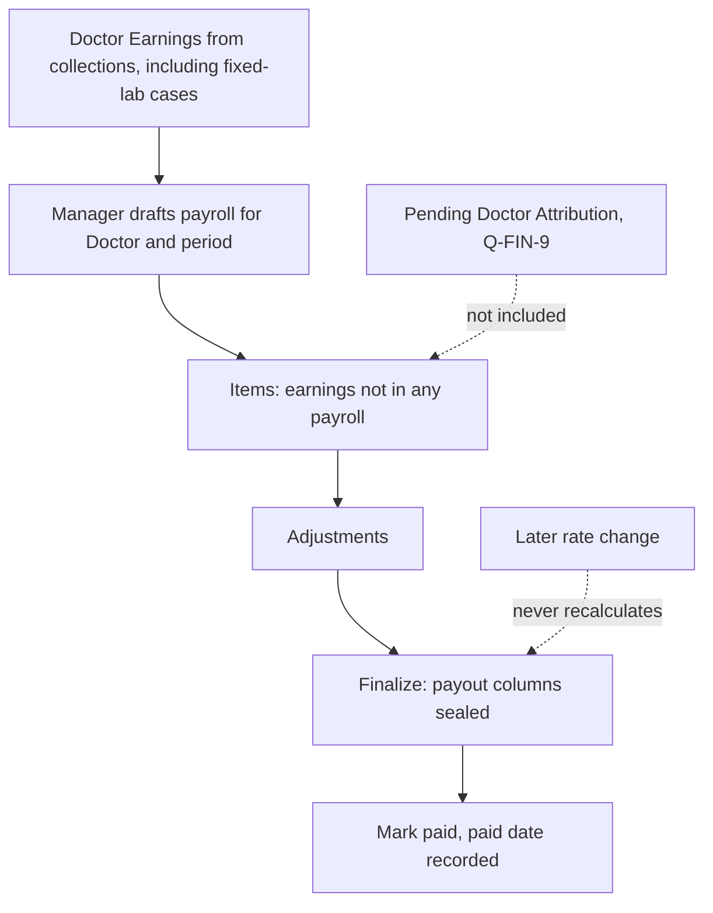
```mermaid
flowchart TD
    DE["Doctor Earnings from collections, including fixed-lab cases"] --> SEL["Manager drafts payroll for Doctor and period"]
    SEL --> IT["Items: earnings not in any payroll"]
    IT --> ADJ["Adjustments"]
    ADJ --> FINAL["Finalize: payout columns sealed"]
    FINAL --> PAID["Mark paid, paid date recorded"]
    PEND["Pending Doctor Attribution, Q-FIN-9"] -.->|"not included"| IT
    CHG["Later rate change"] -.->|"never recalculates"| FINAL
```

---

## Diagram 17: Sales Payroll Workflow

Base, bonus and deductions work now. The commission calculation base is **OPEN**, so finalization stays disabled behind a flag.

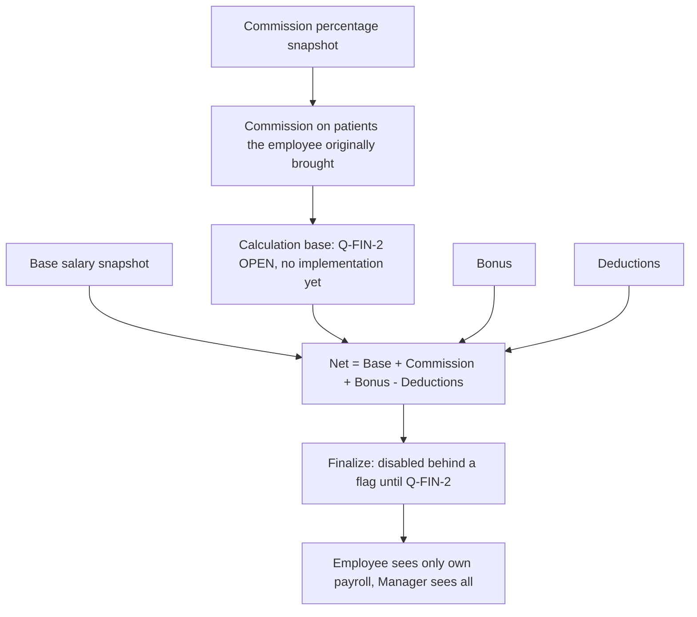
```mermaid
flowchart TD
    BS["Base salary snapshot"] --> NET
    CP["Commission percentage snapshot"] --> CM["Commission on patients the employee originally brought"]
    CM --> BASE["Calculation base: Q-FIN-2 OPEN, no implementation yet"]
    BASE --> NET["Net = Base + Commission + Bonus - Deductions"]
    BO["Bonus"] --> NET
    DE["Deductions"] --> NET
    NET --> FIN["Finalize: disabled behind a flag until Q-FIN-2"]
    FIN --> VIEW["Employee sees only own payroll, Manager sees all"]
```

---

## Diagram 18: Clinic Operating Expense Workflow

Expenses reduce the Clinic result only, never a Doctor share.

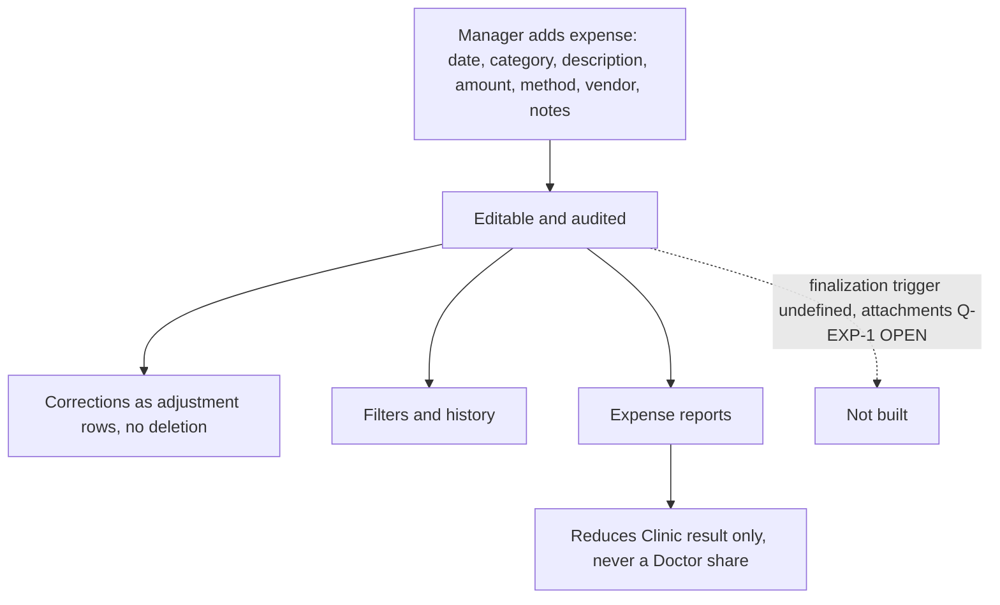
```mermaid
flowchart TD
    M["Manager adds expense: date, category, description, amount, method, vendor, notes"] --> ED["Editable and audited"]
    ED --> ADJ["Corrections as adjustment rows, no deletion"]
    ED --> FL["Filters and history"]
    ED --> RPT["Expense reports"]
    RPT --> RES["Reduces Clinic result only, never a Doctor share"]
    ED -.->|"finalization trigger undefined, attachments Q-EXP-1 OPEN"| NOTE["Not built"]
```

---

## Diagram 19: Notification / Background Job Workflow

Planners and events enqueue deduplicated rows. The dispatcher handles each row in its own transaction, so one failure never rolls back the others. Only Sales and Manager read notifications.

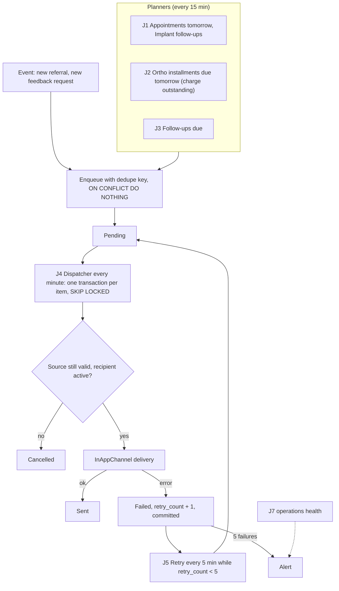
```mermaid
flowchart TD
    subgraph PL["Planners (every 15 min)"]
        J1["J1 Appointments tomorrow, Implant follow-ups"]
        J2["J2 Ortho installments due tomorrow (charge outstanding)"]
        J3["J3 Follow-ups due"]
    end
    EV["Event: new referral, new feedback request"]
    PL --> ENQ["Enqueue with dedupe key, ON CONFLICT DO NOTHING"]
    EV --> ENQ
    ENQ --> PEN["Pending"]
    PEN --> J4["J4 Dispatcher every minute: one transaction per item, SKIP LOCKED"]
    J4 --> VAL{"Source still valid, recipient active?"}
    VAL -->|"no"| CAN["Cancelled"]
    VAL -->|"yes"| SEND["InAppChannel delivery"]
    SEND -->|"ok"| SENT["Sent"]
    SEND -->|"error"| FAIL["Failed, retry_count + 1, committed"]
    FAIL --> J5["J5 Retry every 5 min while retry_count < 5"]
    J5 --> PEN
    FAIL -->|"5 failures"| ALERT["Alert"]
    J7["J7 operations health"] -.-> ALERT
```

---

## Diagram 20: Feedback Workflow

V1 is a manual link sent by Sales. Automated channels are future work behind a channel abstraction.

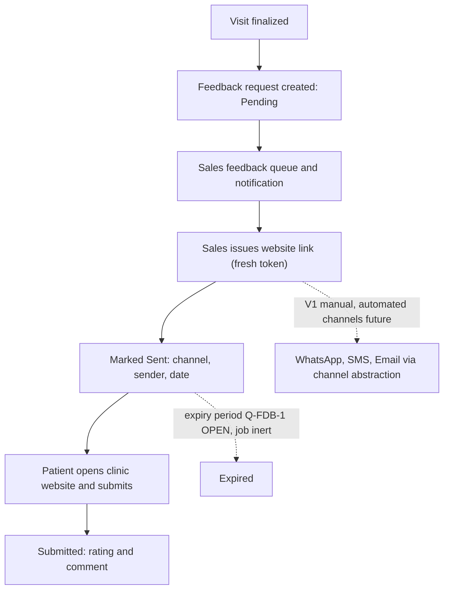
```mermaid
flowchart TD
    V["Visit finalized"] --> R["Feedback request created: Pending"]
    R --> Q["Sales feedback queue and notification"]
    Q --> L["Sales issues website link (fresh token)"]
    L --> S["Marked Sent: channel, sender, date"]
    S --> W["Patient opens clinic website and submits"]
    W --> SUB["Submitted: rating and comment"]
    S -.->|"expiry period Q-FDB-1 OPEN, job inert"| EXP["Expired"]
    L -.->|"V1 manual, automated channels future"| FUT["WhatsApp, SMS, Email via channel abstraction"]
```

---

## Diagram 21: Deployment Architecture

One Linux VM running Docker, one managed PostgreSQL, independent encrypted off-site backups, and external monitoring.

```mermaid
flowchart TB
    NET["Internet"] -->|"443 HTTPS, 80 redirect"| WEB
    subgraph VM["Linux VM (Docker)"]
        WEB["web: Caddy + SPA"] --> API["api"]
        WRK["worker: Hangfire (dashboard on localhost only)"]
        MIG["migrator (deploy time only)"]
        BKP["backup (nightly one-shot)"]
    end
    API -->|"TLS verify-full"| PG[("Managed PostgreSQL + point-in-time recovery")]
    WRK --> PG
    MIG --> PG
    BKP --> PG
    BKP -->|"encrypted, write-only"| OFF["Off-site object-locked storage, different account"]
    MON["External uptime and heartbeat monitor"] -.-> WEB
    VM -.->|"heartbeats, scrubbed errors"| MON
    GH["GitHub Actions"] -->|"forced-command SSH"| VM
```

---

## Diagram 22: Database ERDs (four parts)

Relationships and key columns only. DATABASE_DESIGN.md is the schema of record.

### 22a Identity / Security

```mermaid
erDiagram
    USERS ||--|| USER_ROLES : "one role per account"
    ROLES ||--o{ USER_ROLES : has
    ROLES ||--o{ ROLE_PERMISSIONS : grants
    PERMISSIONS ||--o{ ROLE_PERMISSIONS : in
    USERS |o--o| DOCTORS : "staff link"
    USERS |o--o| SALES_EMPLOYEES : "staff link"
    USERS |o--o{ AUDIT_LOG : acts
    USERS {
        uuid id PK
        string user_name
        bool is_active
    }
    DOCTORS {
        uuid id PK
        numeric current_percentage
        bool is_active
    }
    SALES_EMPLOYEES {
        uuid id PK
        numeric commission_percentage
        bool is_active
    }
    AUDIT_LOG {
        bigint id PK
        string action
        string entity_type
        bool is_restricted
    }
```

### 22b Scheduling / CRM

```mermaid
erDiagram
    PATIENTS ||--|| PATIENT_CONTACTS : "1 to 1"
    SALES_EMPLOYEES |o--o{ PATIENT_CONTACTS : "original owner, nullable"
    PATIENTS ||--o{ PATIENT_DOCTOR_ASSIGNMENTS : history
    DOCTORS ||--o{ PATIENT_DOCTOR_ASSIGNMENTS : "current or previous"
    DOCTORS ||--o{ AVAILABILITY_WEEKS : has
    AVAILABILITY_WEEKS ||--o{ AVAILABILITY_RANGES : contains
    PATIENTS ||--o{ APPOINTMENTS : has
    DOCTORS ||--o{ APPOINTMENTS : attends
    APPOINTMENTS |o--o| APPOINTMENTS : "previous_appointment"
    SALES_EMPLOYEES ||--o{ LEADS : "original owner"
    LEADS |o--o| PATIENTS : "converted to"
    PATIENTS ||--o{ REFERRALS : has
    DOCTORS ||--o{ REFERRALS : creates
    PATIENTS |o--o{ FOLLOW_UPS : about
    SALES_EMPLOYEES ||--o{ FOLLOW_UPS : assigned
    FOLLOW_UPS ||--o{ FOLLOW_UP_CONTACT_ATTEMPTS : "append only"
    PATIENTS |o--o{ NOTIFICATIONS : "related, optional"
    PATIENTS ||--o{ FEEDBACK_REQUESTS : has
```

### 22c Clinical

```mermaid
erDiagram
    PATIENTS ||--o{ VISITS : has
    DOCTORS ||--o{ VISITS : performs
    VISITS |o--o| APPOINTMENTS : "optional link"
    PATIENTS ||--o{ TREATMENT_CASES : has
    PROCEDURE_TYPES ||--o{ TREATMENT_CASES : "type of"
    VISITS ||--o{ TREATMENT_RECORDS : contains
    TREATMENT_CASES ||--o{ TREATMENT_RECORDS : "spans visits"
    TREATMENT_CASES ||--o{ CASE_WORK_ITEMS : "billable work"
    DOCTORS ||--o{ CASE_WORK_ITEMS : "performing doctor"
    TREATMENT_CASES ||--o{ TREATMENT_STEPS : "root canal"
    TREATMENT_CASES ||--o{ ROOT_CANAL_MEASUREMENTS : canals
    TREATMENT_CASES |o--o| IMPLANT_DETAILS : implant
    TREATMENT_CASES |o--o| ORTHO_CASES : orthodontic
    PATIENTS ||--o{ PRESCRIPTIONS : has
    VISITS ||--o{ PRESCRIPTIONS : has
    PRESCRIPTIONS ||--o{ PRESCRIPTION_ITEMS : contains
    CASE_WORK_ITEMS {
        uuid id PK
        numeric doctor_percentage_snapshot
        numeric entered_price
    }
```

### 22d Financial (including Orthodontics and Payroll)

v1.1: `ASSISTANTS` (staff schema) and `ASSISTANT_PAYROLLS` (payroll schema) are added. There is deliberately **no** link from Assistants to any user or identity table (ERD 22a is unchanged).

```mermaid
erDiagram
    CASE_WORK_ITEMS |o--o| PATIENT_CHARGES : "one charge per work item"
    PATIENTS ||--o{ PATIENT_CHARGES : billed
    PATIENTS ||--o{ PAYMENTS : pays
    PAYMENTS ||--o{ PAYMENT_ALLOCATIONS : split
    PATIENT_CHARGES ||--o{ PAYMENT_ALLOCATIONS : receives
    PAYMENT_ALLOCATIONS |o--o| DOCTOR_EARNINGS : "unless held"
    DOCTORS ||--o{ DOCTOR_EARNINGS : attributed
    DOCTOR_EARNINGS |o--o| REVENUE_DISTRIBUTIONS : "completion, may be pending"
    PATIENT_CHARGES ||--o{ ATTRIBUTION_HOLDS : "Q-FIN-9"
    ATTRIBUTION_HOLDS ||--o{ PENDING_DOCTOR_ATTRIBUTIONS : covers
    PAYMENT_ALLOCATIONS |o--o| PENDING_DOCTOR_ATTRIBUTIONS : "held allocation"
    PATIENT_CHARGES ||--o{ CHARGE_ADJUSTMENTS : corrections
    TREATMENT_CASES |o--o| FIXED_LAB_EXPENSES : "one per fixed-lab case"
    FIXED_LAB_EXPENSES ||--o{ FIXED_LAB_REVISIONS : history
    ORTHO_CASES |o--o| PATIENT_CHARGES : "one charge, once terms exist"
    ORTHO_CASES ||--o{ ORTHO_INSTALLMENTS : schedule
    ORTHO_INSTALLMENTS ||--o{ INSTALLMENT_PAYMENTS : "unused until Q-ORT-2"
    PAYMENT_ALLOCATIONS ||--o{ INSTALLMENT_PAYMENTS : consumed
    DOCTORS ||--o{ DOCTOR_PAYROLLS : paid
    DOCTOR_PAYROLLS ||--o{ DOCTOR_PAYROLL_ITEMS : contains
    DOCTOR_EARNINGS ||--o| DOCTOR_PAYROLL_ITEMS : "paid once"
    DOCTOR_PAYROLLS ||--o{ DOCTOR_PAYROLL_ADJUSTMENTS : has
    SALES_EMPLOYEES ||--o{ SALES_PAYROLLS : paid
    SALES_PAYROLLS ||--o{ SALES_PAYROLL_COMMISSION_ITEMS : contains
    SALES_PAYROLLS ||--o{ SALES_PAYROLL_ADJUSTMENTS : has
    ASSISTANTS ||--o{ ASSISTANT_PAYROLLS : "paid; periods never overlap"
    EXPENSE_CATEGORIES ||--o{ CLINIC_EXPENSES : classifies
    CLINIC_EXPENSES |o--o| CLINIC_EXPENSES : "adjusts"
    ASSISTANTS {
        uuid id PK
        text full_name
        numeric current_salary
        boolean is_active
    }
    ASSISTANT_PAYROLLS {
        uuid id PK
        date period_start
        date period_end
        numeric salary_snapshot
        numeric final_amount
        text status
    }
    PATIENT_CHARGES {
        uuid id PK
        numeric original_price
        numeric discount_amount
        numeric final_price
    }
    DOCTOR_EARNINGS {
        uuid id PK
        numeric allocated_amount
        numeric doctor_share
    }
    REVENUE_DISTRIBUTIONS {
        uuid id PK
        numeric doctor_share
        numeric lab_amount
        numeric clinic_share
    }
```

---

## Diagram 23: Assistant Payroll Workflow (v1.1)

Assistants are a staff record and a payroll expense only. They have no account, login, role, notification or operational workflow. Salary only: no bonus, deduction or overtime component exists. `final_amount = salary_snapshot`.

```mermaid
flowchart TD
    MGR["Manager"] --> REC["Assistant staff record (Staff.Manage), no user account"]
    MGR --> SAL["Set current salary (Staff.AssistantSalary.Configure), audited"]
    REC --> CUR["current_salary"]
    SAL --> CUR
    MGR --> DRAFT["Create payroll draft for a period (Payroll.Assistant.ManageAll)"]
    CUR --> SNAP["Salary snapshot copied into the payroll"]
    DRAFT --> SNAP
    SNAP --> FA["final_amount = salary_snapshot, no free amount"]
    FA --> CHK{"Needs partial-period or mid-period calculation?"}
    CHK -->|"yes, Q-PAY-ASST-2 OPEN"| BLK["Cannot be finalized, no proration"]
    CHK -->|"no"| FIN["Finalize: snapshot sealed, never recalculated"]
    FIN --> PAID["Mark paid: paid date recorded"]
    FIN --> EXP["Assistant Payroll Expense"]
    PAID --> EXP
    EXP --> RNG{"Report range fully contains the payroll period?"}
    RNG -->|"yes"| RES["Estimated Clinic Operating Result"]
    RNG -->|"partial overlap, Q-PAY-ASST-1 OPEN"| INC["Line PENDING / NOT ALLOCATED, result INCOMPLETE"]
    GR["Clinic Gross Revenue, never reduced by Assistant salary"] --> RES
    SP["Sales Salary / Commission"] --> RES
    OE["Clinic Operating Expenses"] --> RES
```

The result is Clinic Gross Revenue − Sales Salary / Commission − Assistant Payroll Expense − Clinic Operating Expenses − other confirmed Clinic-owned expenses. Doctor Payroll is never subtracted again.

---

## Freeze-review corrections applied to the Step 15 diagrams

Only genuine inconsistencies were changed. No approved behavior was redesigned.

| Diagram | Correction | Reason |
|---|---|---|
| 1 | Feedback result path labelled "token endpoint or manual marking" | The path is still undecided (Q-FDB-2), and the earlier label implied a fixed integration. |
| 3 | Added the dependency arrows that Step 6.3 and Step 9.13 define but Step 15 omitted (including Finance to Staff). The misleading "Reporting to Payroll" arrow was replaced by a note. | The architecture tests enforce the full list, so the diagram must show it. |
| 4 | Manager linked to the clinical-write group. Doctor and contact keys shown with a valid "never" edge. | Step 8 and Step 11 give the Manager access to non-finalized clinical write endpoints. |
| 11 | Added the "Ortho charge established" node between terms and schedule. ERD 22d shows the ortho-case-to-charge link as optional. | Step 11 allows a case without terms or a charge, so the link cannot be mandatory (freeze conflict C1). |
| 22a | Removed the Settings-to-AuditLog relationship. Audit user link is optional. | `audit_log.entity_id` has no foreign key by design, and failed logins have no user. |
| 22b | Original-owner link is optional (nullable). Added Patient to FollowUps. Notification patient link is optional. | The owner is nullable (Step 11), and follow-ups and notifications have optional patients (Step 7). |
| 22d | Added Doctors to DoctorEarnings. | Earning attribution is a stored relationship. |

## v1.1 changes (Assistant payroll)

| Diagram | Change |
|---|---|
| 23 (new) | Assistant Payroll Workflow, ending in the Estimated Clinic Operating Result. |
| 4 | Note only: Assistant is not an application role. No node added. |
| 22d | Added `ASSISTANTS` and `ASSISTANT_PAYROLLS`. |
| 1, 2, 3, 22a | Reviewed, no change: no new actor, no new module, no Assistant–Identity link. |
| 14, 16, 17, 18 | Reviewed, no change. The operating-result input from Assistant payroll is drawn in Diagram 23. |

## v1.1 changes (Scheduling correction)

| Diagram | Change |
|---|---|
| 5, 8 | Scheduling correction: Check-In node removed from Diagram 5 (Appointment goes to Visit / Doctor treatment with no invented node); Diagram 8 now shows exactly the 7 states, with Scheduled / Confirmed going directly to In Treatment when the Doctor starts the linked visit. |
| 4 | Reviewed: it shows no Appointment CheckIn permission, so no change. |
